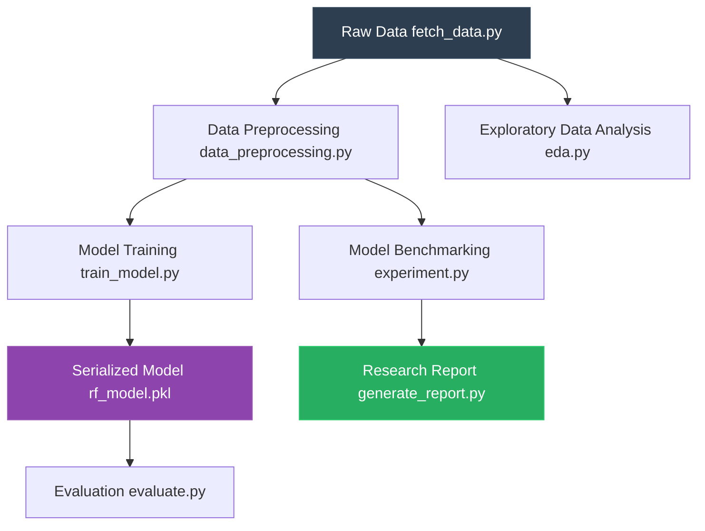

# 📉 Customer Churn Prediction (Classification)


A baseline Random Forest catches **48% of churning customers**. A balanced Logistic Regression catches **79%**. This repo ships the pipeline that proves it — data fetch, preprocessing, three-model comparison, and a PDF research report, all in one `python` command.

## Problem Statement
Which customers are most likely to cancel their subscription, and what factors drive churn?

## Dataset
- **Source:** [Telco Customer Churn (Kaggle)](https://www.kaggle.com/datasets/blastchar/telco-customer-churn)
- **Size:** 7,043 customers × 21 features
- **Description:** Binary target (`Churn`: Yes/No). ~27% churn rate. Contains customer demographics, account information, and service usage metrics. The script `src/fetch_data.py` pulls it automatically.

## Approach
1. **Data Cleaning & EDA** — Cleans nulls, generates distribution, tenure, charges, and contract plots.
2. **Feature Engineering** — Encodes categorical variables, scales numerical variables using `StandardScaler`, and splits the data 80/20.
3. **Modeling** — Compares 6 model variants (Random Forest, Logistic Regression, XGBoost, MLP Neural Network). Uses hyperparameter tuning and class weighting to address the 73/27 class imbalance.
4. **Evaluation** — Evaluates using Precision, Recall, F1-Score, and AUC-ROC, generating confusion matrices and a comprehensive PDF report.

## Key Results
| Model | Accuracy | Churn Precision | Churn Recall | Churn F1 |
|--------|-------|-------|-------|-------|
| Random Forest (Baseline) | 78.5% | 0.63 | 48% | 0.54 |
| Logistic Regression (Balanced) | 73.1% | 0.50 | 79% | 0.61 |
| Deep Learning (MLP) | 73.0% | 0.49 | 37% | 0.42 |

## Key Findings
1. A baseline Random Forest looks great on paper (78.5% accuracy) but silently ignores half the customers who are about to leave (48% recall).
2. The balanced Logistic Regression model trades 5 points of overall accuracy to catch **31% more churners** (79% recall) than the baseline.
3. **Business Implication:** Accuracy is a vanity metric for imbalanced churn data. By prioritizing Recall through class weights, the business can accurately target the majority of at-risk customers for proactive retention campaigns.

## How to Run

```bash
pip install -r requirements.txt
python src/fetch_data.py           # pulls Telco dataset → data/
python src/eda.py                  # EDA plots → plots/
python src/train_model.py          # trains model → models/
python src/evaluate.py             # classification report + confusion matrix
python src/generate_report.py      # 3-model comparison → churn_prediction_report.pdf
```

## Files
- `src/fetch_data.py` — Downloads Telco Customer Churn CSV
- `src/data_preprocessing.py` — Cleans data, scales, and splits 80/20
- `src/eda.py` — Generates distribution and demographic plots
- `src/train_model.py` — Trains balanced `LogisticRegression`, serializes to pickle
- `src/evaluate.py` — Evaluates test set and saves confusion matrix
- `src/experiment.py` — Benchmarks 6 model variants
- `src/generate_report.py` — Trains RF + LR + Deep Learning (MLP) and renders a multi-page PDF
- `churn_prediction_report.pdf` — The final auto-generated research report

## Methodology & Limitations
The pipeline uses a modular approach, separating data ingestion, preprocessing, training, and evaluation into distinct scripts to ensure reproducibility. It includes automated testing via `pytest` covering preprocessing and model instantiation, integrated directly into a GitHub Actions CI pipeline.

One limitation is that the models assume historical patterns will perfectly predict future churn without accounting for external macroeconomic factors or recent uncaptured marketing campaigns. Additionally, the Deep Learning (MLP) model was run without an exhaustive hyperparameter search due to computational limits; a more robust tuning process could potentially improve its recall relative to the balanced Logistic Regression.

---

### Pipeline Architecture


