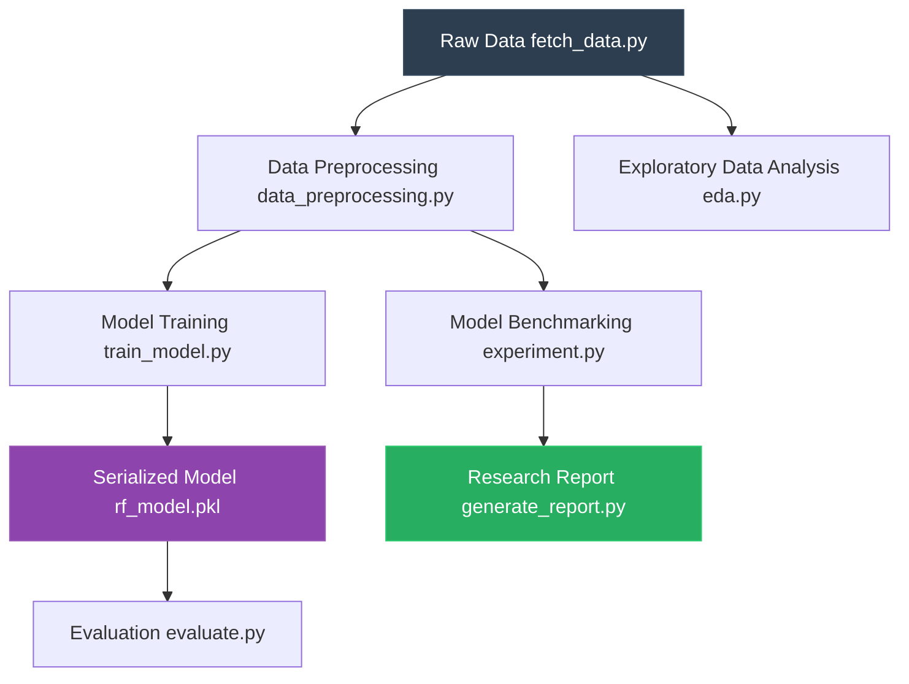

# 📉 48% → 79% Churn Recall: How Class Weights Beat a Random Forest


A baseline Random Forest catches **48% of churning customers**. A balanced Logistic Regression catches **79%**. This repo ships the pipeline that proves it — data fetch, preprocessing, three-model comparison, and a PDF research report, all in one `python` command.

---

## Results at a Glance

| Model | Accuracy | Churn Recall | Churn F1 | Strategy |
|---|---|---|---|---|
| Random Forest (Baseline) | **78.5%** | 48% | 0.54 | Default — optimizes for majority class |
| Logistic Regression (Balanced) | 73.1% | **79%** | **0.61** | `class_weight='balanced'` — penalizes missed churners |
| Deep Learning (MLP) | 73.0% | 37% | 0.42 | Finetuned Multi-Layer Perceptron (RandomizedSearchCV) |

**The takeaway:** accuracy is a vanity metric when your classes are imbalanced 73/27. The baseline looks great on paper but silently ignores half the customers who are about to leave. While a Deep Learning (MLP) model captures non-linear complexity, without explicit class balancing it performs the worst on recall. The balanced Logistic Regression model trades 5 points of accuracy to catch 31% more churners than the baseline.

> The full comparison — confusion matrices, metric tables, and strategic recommendation — is auto-generated as a research-grade PDF via `python src/generate_report.py`.

---

## Pipeline Architecture



---

## Run the Pipeline

```bash
pip install -r requirements.txt
python src/fetch_data.py           # pulls Telco dataset → data/
python src/eda.py                  # EDA plots → plots/
python src/train_model.py          # trains model → models/
python src/evaluate.py             # classification report + confusion matrix
python src/generate_report.py      # 3-model comparison → churn_prediction_report.pdf
```

---

## What Each Script Does

| Script | Job | Output |
|---|---|---|
| `src/fetch_data.py` | Downloads Telco Customer Churn CSV | `data/telco_customer_churn.csv` |
| `src/data_preprocessing.py` | Cleans nulls, encodes categoricals, scales numericals with `StandardScaler`, splits 80/20 | Returns `X_train, X_test, y_train, y_test` |
| `src/eda.py` | Generates distribution, tenure, charges, and contract plots | `plots/*.png` |
| `src/train_model.py` | Trains balanced `LogisticRegression`, serializes to pickle | `models/rf_model.pkl` |
| `src/evaluate.py` | Loads model, runs test set, prints classification report, saves confusion matrix | `plots/confusion_matrix.png` |
| `src/experiment.py` | Benchmarks 6 model variants (RF, RF Balanced, LR Balanced, XGB, XGB Weighted, XGB+SMOTE) | Console output with F1 scores |
| `src/generate_report.py` | Trains RF + LR + Deep Learning (MLP) with hyperparameter tuning, renders a multi-page PDF with Platypus | `churn_prediction_report.pdf` |

---

## Project Structure

```text
customer_churn_prediction/
├── .github/workflows/
├── data/
├── models/
├── plots/
├── src/
├── tests/
├── churn_prediction_report.pdf
├── pytest.ini
├── requirements.txt
└── .gitignore
```

### Directory Breakdown

| Path | Purpose |
|---|---|
| **`.github/workflows/`** | CI/CD automation. Contains `ci.yml` which runs `pytest` and coverage on every push. |
| **`data/`** | Stores the raw and processed CSV datasets. This directory is gitignored. |
| **`models/`** | Contains serialized model artifacts (like `rf_model.pkl`) generated during training. |
| **`plots/`** | Output directory for all EDA visualizations and confusion matrices. |
| **`src/`** | The core source code. Contains all scripts for the ML pipeline (`fetch_data.py`, `train_model.py`, etc). |
| **`tests/`** | Unit tests for data preprocessing and model instantiation, executed via `pytest`. |
| **`churn_prediction_report.pdf`** | The final, auto-generated research report comparing model performances. |
| **`pytest.ini`** | Configuration file for the `pytest` framework. |
| **`requirements.txt`** | Pinned Python dependencies required to run the pipeline. |

---

## Testing & CI

```bash
pytest                           # 2 tests, covers preprocessing + model instantiation
```

GitHub Actions runs `pytest --cov=src --cov-report=xml` on every push and PR to `main`. The badge at the top of this README reflects the latest pipeline status.

---

## Requirements

- Python 3.10+
- pandas, numpy, scikit-learn, matplotlib, seaborn
- xgboost, imbalanced-learn
- reportlab (PDF generation)
- pytest, pytest-cov (testing)

Full list in [`requirements.txt`](requirements.txt).

---

## Dataset

[Telco Customer Churn](https://www.kaggle.com/datasets/blastchar/telco-customer-churn) — 7,043 customers, 21 features, binary target (`Churn`: Yes/No). ~27% churn rate. The script `src/fetch_data.py` pulls it automatically; no manual download needed.
